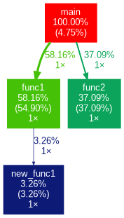

# UNIVERSIDAD NACIONAL DE CÓRDOBA
# FACULTAD DE CIENCIAS EXACTAS, FÍSICAS Y NATURALES

## SISTEMAS DE COMPUTACIÓN	
## Trabajo Práctico N°1: Rendimiento
### Grupo: BugBusters

- Alfici Facundo
- Capdevila Gastón
- Viberti Tomas

### Docentes
- Jorge, Javier Alejandro
- Solinas, Miguel

### 2026

---
# Informé PC de Gastón Capdevila

## GPROF

Debemos asegurarnos de que la generación de perfiles esté habilitada cuando se complete la compilación del código. Esto es posible al agregar la opción '-pg' en el paso de compilación.


**Ejecutar la herramienta gprof**


---

### 1. Suprima la impresión de funciones declaradas estáticamente (privadas) usando -a
Aplicando la flag -a se suprimen las funciones declaradas estáticamente (privadas). Por ejemplo, en este caso la func2 no devolverá información por ser estática.

**gprof -a test_gprof gmon.out > analysis.txt**


### 2. Elimine los textos detallados usando -b
Aplicando la flag -b se suprimen los textos detallados. Entonces podemos observar que se obtienen solo gráficos y resultados concretos del test.

**gprof -b test_gprof gmon.out > analysis.txt**


### 3. Imprima solo perfil plano usando -p
Aplicando la flag -p se obtiene como salida solo el perfil plano.

**gprof -p test_gprof gmon.out > analysis.txt**


### 4. Imprimir información relacionada con funciones específicas en perfil plano

**gprof -pfunc1 -b test_gprof gmon.out > analysis.txt**


### Grafico


---

## Profiling con linux perf


**$ sudo perf report**


- La imagen muestra el reporte de perf con las funciones de test_gprof ordenadas por tiempo de CPU. 
- Las funciones propias del programa son `func1` (49,10%), `func2` (40,51%), `new_func1` (3,95%) y `main` (2,68%). 
- El resto son funciones del kernel Linux (`[k]`) que se pueden ignorar.

---
# Informe PC Tomás Viberti

## GPROF


A continuación se muestra el analysis.txt obtenido:


Si se ejecuta el comando con el comando de supresión de las funciones declaradas estáticamente, se obtiene lo siguiente:


Si se eliminan los textos detallados usando el comando -b:


Si ahora solo se imprime el perfil plano con el comando -p:


Y si se quiere imprimir información especifica de una función en perfil plano, en este caso func1, se obtiene:


Por otro lado, si se genera el gráfico con gprof2dot mediante el comando “gprof ./test_gprof gmon.out | gprof2dot | dot -Tpng -o grafo_perfilado.png”, se obtiene el siguiente gráfico:


Por último si se ejecuta el codigo con perfilado usando perf:


# Informe de Facundo ALFICI

## GPROF

Como primera medida, se compiló el código habilitando la creación de perfiles.


Esto generó un archivo binario, el cual se ejecutará para generar la información de perfiles.


Con esto, se generó el archivo analysis utilizando la herramienta GPROF.


Empezando la customización de las flags de salida de la herramienta, se plantea suprimir la impresión de funciones estáticas, utilizando la siguiente línea de código.
**$ gprof -a test_gprof gmon.out > analysis_3.txt**


Luego, se eliminarán los textos detallados con -b
**$ gprof -b test_gprof gmon.out > analysis_3.txt**


Posteriormente, se imprimirá unicamente el perfil plano utilizando -p
**$ gprof -p -b test_gprof gmon.out > analysis_3.txt**


Y, para terminar esta etapa, se imprimirá solamente la información de la función específica "func1"
**$ gprof -pfunc1 -b test_gprof gmon.out > analysis_3.txt**


Por otro lado, se quiere graficar utilizando dos herramientas diferentes.
Primeramente, se usará gprof2dot para generar una visualización de la salida de gprof.



Para la segunda herramienta, se utilizará Linux perf.


## Benchmarks
# Reporte de Benchmarking y Rendimiento del Sistema

 Un benchmark es una prueba de rendimiento estandarizada que se realiza sobre un componente o un sistema de software para medir su capacidad, rendimiento, eficacia. Los benchmarks realizan una serie de tareas predefinidas y exigentes, y mide cuánto tiempo tarda nuestro sistema en completarlas. En base al tiempo de ejecución que conlleve, se obtiene un score.

 Hay una gran cantidad de benchmarks disponibles los cuales se ajustan a cada componente o sistema operativo, como windows o Linux. Como ejemplo se pueden mencionar:

### **Linux**
* **Llama.cpp**: Rendimiento en modelos de lenguaje (IA).
* **Timed Linux Kernel Compilation**: Velocidad de procesamiento de archivos.
* **Blender**: Renderizado 3D.
* **Hashcat**: Criptografía y seguridad.
* **OpenVINO GenAI / OpenGL**: Gráficos y aceleración de IA.

### **Windows**
* **PCMark 10**: Rendimiento general de oficina.
* **UserBenchmark**: Comparativa rápida de componentes.
* **Cinebench**: Renderizado de CPU puro.
* **Geekbench**: Rendimiento sintético mono y multihilo.
* **3DMark (Time Spy / Port Royal)**: Rendimiento gráfico en gaming.


## Tareas Diarias y Benchmarks Asociados

Esta tabla resume la relación entre el flujo de trabajo personal y la herramienta de medición ideal:

| Tarea Diaria | Benchmark | Detalle del Benchmark |
| :--- | :--- | :--- |
| **Gaming (AAA)** | 3DMark Time Spy / Port Royal | Esta tarea implica mucho poder de procesamiento tanto por parte del CPU como de la GPU. Este benchmark permite estresar dichos componentes a través de tareas de renderizado pesado. |
| **Programación** | Geekbench 6 (Multi-core) | En esta tarea se incluyen actividades de programacion simples hasta actividades de programación multihilos, por ejemplo para levantar microservicios en docker. Este benchmark mide la capacidad de procesar hilos en paralelo y recae sobre el CPU. |
| **Compilación de código** | Linux Kernel Compilation | Para la realización de varios proyectos académicos utilizo Linux. Este bench mide el tiempo que tarda el CPU en procesar muchos archivos pequeños.|
| **Pestañas multitarea** | PCMark 10 | Este bench simula la navegación web, edición de documentos y videollamadas de manera simultánea.|


## Análisis de Rendimiento (Casos Prácticos)

Utilizando los datos de la tarea **Timed Linux Kernel Compilation**, realizamos las siguientes comparativas:

### 1. Comparativa de Rendimiento
* **Intel Core i5-13600K**: $72 \pm 5$ seg.
* **AMD Ryzen 9 5900X**: $76 \pm 8$ seg. 

A simple vista, podemos decir que el i5 13600K tiene mejor rendimiento para compilar el Kernel de Linux. Si hacemos la comparativa utilizando la fórmula:

$$\frac{\text{Rendimiento } i5}{\text{Rendimiento } R9} = \frac{76s}{72s} = 1.055$$

> **Resultado:** El **Intel Core i5-13600K** es un **5,5% más rápido** que el Ryzen 9 5900X en esta tarea.

### 2. Cálculo de Aceleración ($S$)
Si utilizamos un RYzen 9 7950X 16 core, para el cual el tiempo es de 50 +/- 6 seg, entonces la aceleracion es:

$$S = \frac{T_{viejo}}{T_{nuevo}} = \frac{76s}{50s} = 1.52$$

> **Resultado:** El Ryzen 9 7950X (16 core) ofrece una aceleración de **1.52x**, lo que significa que es un **52% más rápido** que el modelo 5900X 12 core.

# Tiempo de programa según variación de frecuencia

Se desea ejecutar sobre una ESP32 un código que demore alrededor de 10 segundos para una frecuencia determinada de reloj. El objetivo es variar la frecuencia de reloj y permitir ver las diferencias obtenidas en el tiempo del programa.

En primera medida, se presentará el código del programa:
```c
void setup() {
  Serial.begin(115200);
  // Configurar la frecuencia
  setCpuFrequencyMhz(80);
  Serial.print("Frecuencia de CPU configurada: ");
  Serial.print(getCpuFrequencyMhz());
  Serial.println(" MHz");

  unsigned long inicio = millis();

  // Bucle
  volatile unsigned long resultado = 0;
  for (unsigned long i = 1; i <= 53000000; i++) {
    resultado += i ^ (i % 123);
  }
  unsigned long fin = millis();
  unsigned long tiempo = fin - inicio;
  Serial.print("Resultado final: ");
  Serial.println(resultado);
  Serial.print("Tiempo de ejecución: ");
  Serial.print(tiempo / 1000.0);
  Serial.println(" segundos");
}
void loop() {}
```
Con este código, se puede obtener la siguiente respuesta para una frecuencia de 80MHz.


Mientras que, para los 160MHz, se tiene que:


Concluyendo así que, para un cambio de frecuencia, se nota una diferencia clara entre los tiempos de programa, donde el mismo se ve reducido a la mitad para una frecuencia que es el doble de la original.
